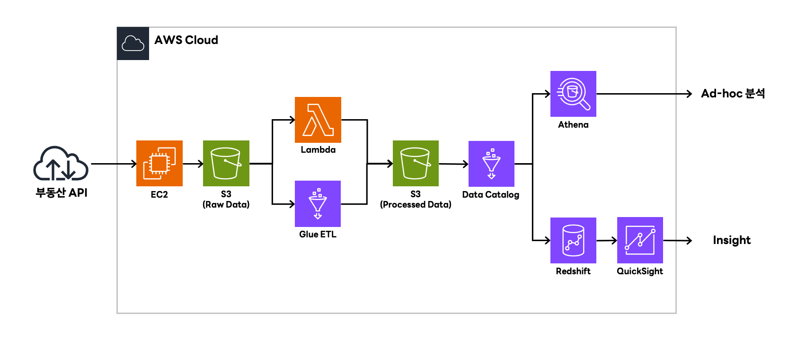

---

# Real Estate Transaction Data Pipeline

AWS-based data pipeline for collecting, storing, and analyzing apartment transaction data from the Korean Public Real Estate API.

---

# Architecture



```
Public Real Estate API
        │
        ▼
Data Ingestion (Python)
        │
        ▼
S3 Raw Data Lake
        │
        ▼
Glue / Lambda ETL
        │
        ▼
S3 Processed Data
        │
        ▼
Glue Data Catalog
        │
 ┌──────┴─────────┐
 ▼                ▼
Athena         Redshift
Ad-hoc Query   Data Warehouse
                     │
                     ▼
                QuickSight
                BI Dashboard
```

---

# Pipeline Stages

## Data Ingestion

Source

* Korean Public Data Portal Real Estate Transaction API

Process

* API request using `requests`
* XML response parsing using `ElementTree`
* Pagination handling based on `totalCount`

Output format

```
[
  {
    "sggCd": "11110",
    "aptNm": "Apartment Name",
    "dealAmount": "120000",
    "dealYear": "2024",
    "dealMonth": "01",
    "dealDay": "15"
  }
]
```

---

## Raw Data Lake

Storage layer

```
Amazon S3
```

Partition structure

```
apt-trade-raw/
 └── deal_ymd=YYYYMM/
      └── lawd_cd=XXXXX/
           └── result.json
```

Example

```
s3://bucket/apt-trade-raw/deal_ymd=202401/lawd_cd=11110/result.json
```

Partition keys

```
deal_ymd
lawd_cd
```

---

## ETL Processing

Processing layer

```
AWS Glue
AWS Lambda
```

Typical transformations

* JSON to Parquet conversion
* schema normalization
* data type transformation
* partition optimization

Output structure

```
apt-trade-processed/
 └── deal_ymd=202401/
      └── lawd_cd=11110/
           └── part-000.parquet
```

---

## Metadata Layer

Metadata management

```
AWS Glue Data Catalog
```

Example table

```
database: real_estate
table: apt_trade
format: parquet
```

---

## Query Layer

Query engine

```
Amazon Athena
```

Example query

```sql
SELECT
    sggCd,
    COUNT(*) AS trade_count
FROM apt_trade
GROUP BY sggCd
ORDER BY trade_count DESC;
```

---

## Analytics Layer

Data warehouse and visualization

```
Amazon Redshift
Amazon QuickSight
```

Typical analytics

* transaction volume by region
* monthly average price
* price per area analysis

---

# Project Structure

```
apt-trade-data-pipeline
│
├── main.py
├── README.md
├── requirements.txt
│
├── src
│   ├── ingestion
│   │    └── api_collector.py
│   │
│   ├── transform
│   │    └── xml_parser.py
│   │
│   └── load
│        └── s3_uploader.py
│
├── docs
│   └── architecture.png
│
└── data
     └── sample
```

---

# Tech Stack

Language

```
Python
```

AWS Services

```
Amazon S3
AWS Glue
AWS Lambda
Amazon Athena
Amazon Redshift
Amazon QuickSight
```

Libraries

```
requests
boto3
jsonlines
python-dotenv
```

---

# Execution

Environment variables

```
SERVICE_KEY=API_KEY
AWS_ACCESS_KEY_ID=AWS_KEY
AWS_SECRET_ACCESS_KEY=AWS_SECRET
AWS_DEFAULT_REGION=ap-northeast-2
```

Run

```
python main.py
```

---

# Data Source

Korean Public Data Portal

```
Real Estate Transaction API
https://www.data.go.kr
```

---

# Future Work

* Parquet-based storage optimization
* incremental data ingestion
* workflow orchestration using Airflow
* data quality validation
* streaming pipeline extension

---
